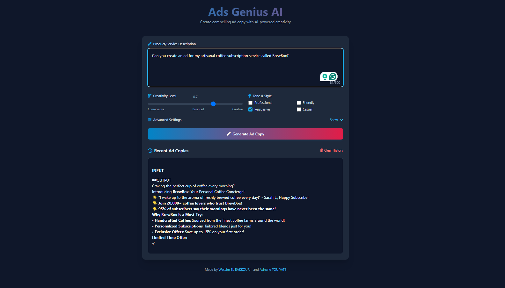

# Ads Genius AI 🚀

A lightweight LLM fine tuned on an Ads copy dataset to generate ads copy,depending on the user prompt.



## 🤖 Model Architecture

This project uses **Microsoft Phi-2** (2.7B parameters) as the base model with LoRA (Low-Rank Adaptation) fine-tuning on a specialized advertising copy dataset:

- **Base Model**: [Microsoft Phi-2](https://huggingface.co/microsoft/phi-2) - A 2.7B parameter language model with state-of-the-art reasoning capabilities
- **Fine-tuning Method**: LoRA (Low-Rank Adaptation) for parameter-efficient training
- **Training Dataset**: Curated collection of high-quality advertising copy across various industries and styles
- **Fine-tuned Weights**: Available at [Adnane10/AdsGeniusAI](https://huggingface.co/Adnane10/AdsGeniusAI) on Hugging Face

The model is optimized for generating creative, contextually relevant advertising copy while maintaining a small deployment footprint.

## 🌟 Features

- **Customizable Tone & Style**: 
  - Professional
  - Friendly
  - Persuasive
  - Casual
- **Advanced Generation Controls**:
  - Temperature (Creativity Level)
  - Top-p (Nucleus Sampling)
  - Top-k Filtering
  - Repetition Penalty
  - Maximum Token Length

## 🛠️ Technical Stack

- Python
- FastAPI
- Key Components:
  - Transformers (Hugging Face)
  - PyTorch
  - PEFT (Parameter-Efficient Fine-Tuning)
  - NumExpr
- Frontend:
  - HTML/CSS/JavaScript
  - Tailwind CSS

## 📊 Data Pipeline

This project includes a robust data pipeline for generating high-quality ad copy examples using Azure OpenAI. The pipeline is used to create training and evaluation datasets for fine-tuning the model.

### Key Features
- Generates ad copy examples for various fields/categories
- Processes fields in batches to avoid rate limits
- Handles parsing errors and fixes JSON issues
- Saves results to structured JSON files

### Directory Structure
The data pipeline is located in the `data/` directory with its own documentation and requirements:
- [Data Pipeline Documentation](data/README.md) - Detailed usage instructions
- [Data Pipeline Requirements](data/requirements.txt) - Specific dependencies

### Quick Start
```bash
# Install data pipeline dependencies
pip install -r data/requirements.txt

# Or use the Makefile target
make install-data-pipeline

# Run the data pipeline
python -m data.cli --fields demo
```

For more details on the data pipeline, see the [dedicated documentation](data/README.md).

## 🚀 Getting Started

### Prerequisites
- Python 3.8+
- Node.js (Optional for Tailwind CSS,just for the frontend)
- CUDA-capable GPU (recommended)

### Installation

1. Clone the repository:
```bash
git clone https://github.com/yourusername/ads-genius-ai.git
cd ads-genius-ai
```

2. Install dependencies:
```bash
make install
```

3. Run the application:
```bash
make run
```

4. Access the web interface:
```
http://localhost:8000
```

## 🎯 Usage

1. Enter your product/service description in the text area
2. Adjust generation parameters:
   - Set creativity level using the temperature slider
   - Select desired tone(s)
   - Fine-tune advanced parameters if needed
3. Click "Generate Ad Copy"
4. View, copy, and manage generated content
5. Access history of previous generations

## 🔧 Configuration

### Model Settings
- `BASE_MODEL`: Base language model path/identifier
- `LORA_WEIGHTS`: Path to LoRA fine-tuning weights
- `DEVICE`: Computing device (cuda/cpu)

### Generation Parameters
- `DEFAULT_MAX_NEW_TOKENS`: Maximum generation length
- `DEFAULT_TEMPERATURE`: Creativity level (0.0-1.0)
- `DEFAULT_TOP_P`: Nucleus sampling parameter
- `DEFAULT_TOP_K`: Top-k filtering parameter
- `DEFAULT_REPETITION_PENALTY`: Penalty for repeated content

## 🔄 Request Pipeline

The application implements a sophisticated request handling pipeline to manage high traffic and ensure optimal performance:

### Queue System
- **Parallel Request Limiting**: Configurable maximum number of concurrent requests (`MAX_PARALLEL_REQUESTS`)
- **Request Queuing**: Automatically queues requests when the system reaches capacity
- **Fair Processing**: First-in, first-out (FIFO) queue management
- **Queue Monitoring**: Real-time queue status available via API endpoint (`/api/queue/status`)

### Request Lifecycle
1. **Submission**: Client submits completion request to `/api/complete` endpoint
2. **Queue Management**: 
   - If system capacity available: Request processed immediately
   - If at capacity: Request added to queue with unique ID
3. **Processing**: 
   - Request handled by LLM service with specified parameters
   - Model generates completion with selected tone and settings
4. **Response**: 
   - Generated ad copy returned to client
   - Includes metadata (token counts, processing time)
5. **Queue Advancement**: Next queued request automatically processed

### Performance Features
- **Request Headers**: Response headers include queue metrics (`X-Queue-Size`, `X-Active-Requests`)
- **Health Monitoring**: Health check endpoint (`/api/health`) provides system status
- **Graceful Degradation**: Service unavailable (503) responses when system overloaded
- **Singleton Model**: Single model instance shared across requests for memory efficiency

## 🔒 Security Features

- Input sanitization
- XSS protection via DOMPurify
- Rate limiting
- Error handling and logging
- Secure content storage

## 📊 Performance Optimization

- Batch processing for efficient inference
- Model quantization options
- Caching mechanisms for frequently used prompts
- Asynchronous processing for better user experience

## 🤝 Contributing

Contributions are welcome! Please feel free to submit a Pull Request.

1. Fork the repository
2. Create your feature branch (`git checkout -b feature/amazing-feature`)
3. Commit your changes (`git commit -m 'Add some amazing feature'`)
4. Push to the branch (`git push origin feature/amazing-feature`)
5. Open a Pull Request

## 📝 License

This project is licensed under the MIT License - see the LICENSE file for details.

## 👥 Authors

- Wassim EL BAKKOURI (wassim.elbakkouri@yahoo.com)
- Adnane TOUIYATE (adnane.touiyate@gmail.com)

## 🙏 Acknowledgments

- Hugging Face Transformers team
- Open-source contributors

---

For support or inquiries, please contact the authors or open an issue on GitHub.